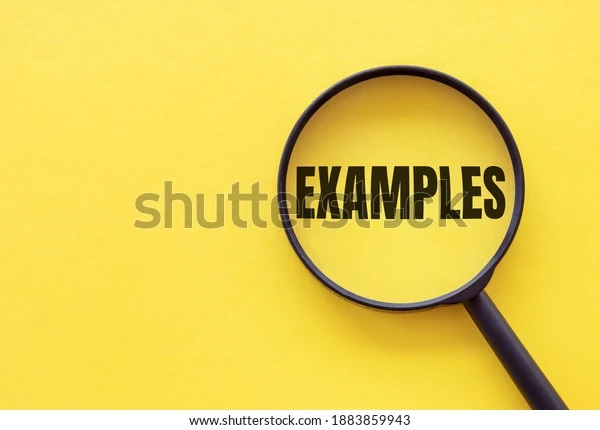

# BASIC JS Course
This tutorial is based on Mozilla Tutorial about JavaScript available [here](https://developer.mozilla.org/pt-BR/docs/Learn/Getting_started_with_the_web/JavaScript_basics">).

## 1. First Run
### Shows an alert message on the page

```
<script lang="javascript">
  alert('This is the first JavaScript running!')
</script>
```

## 2. Declare const and change an element

### Select an element on the page and change its value

#### **`index.html`**
``` html
<script lang="javascript" src="js/first-file.js"></script>
```

#### **`js/first-file.js`**
``` js
// First example override page title
const myHeading = document.querySelector('h1')
myHeading.textContent = 'Hello world!'
```

## 3.Variables
### 
``` js
let myVariable;
myVariable = "Bob";
let myVariable = "Bob";
```
Data types can be viewed [here](https://developer.mozilla.org/pt-BR/docs/Web/JavaScript/Data_structures)

## 4. Comments
### Comments could be added by using // for one line and /**/ for multiple lines
``` js
// Comment of just one line

/*
  Comment of more than one line
*/
```

## 5. Operators

There are a lot more operators to explore, but this is enough for now. See Expressions and operators for a [complete list](https://developer.mozilla.org/en-US/docs/Web/JavaScript/Reference/Operators).

#### Addition 
#### **`index.html`**

``` html
<div class="sum">
  <button onclick="sum(5,10)">Executar soma de valores</button>
  <div id="sum_result"></div>
</div>
```
#### **`js/first-file.js`**
``` js
function sum(a, b) {
  let c = a + b
  const resultSumObject = document.getElementById('sum_result')
  resultSumObject.textContent = c
}
```

### Strict equality (=\==) and Not, Does-not-equal (!, !==)

## 6. Conditionals 

### If .. else ..


#### **`js/first-file.js`**
``` js
let iceCream = 'chocolate'

if (iceCream === 'chocolate') {
  alert('Yay, I love chocolate ice cream!')
} else {
  alert('Awwww, but chocolate is my favorite…')
}
```

## 7. Functions
#### **`index.html`**
``` html
<div class="multiply">
  <button onclick="multiply(this,5,10)">Executar multiplicação</button>
  <div id="multiply_result"></div>
</div>
```
#### **`js/first-file.js`**
``` js
function multiply(num1, num2) {
  let result = num1 * num2;
  return result;
}
```

## 8. Events
### 
#### **`index.html`**
``` html

```
#### **`js/first-file.js`**
``` js
function changeImage(myImage) {
  const mySrc = myImage.getAttribute('src')
  if (mySrc === 'images/example.jpg') {
    myImage.setAttribute('src', 'images/article-image.jpg')
  } else {
    myImage.setAttribute('src', 'images/example.jpg')
  }
}
```

